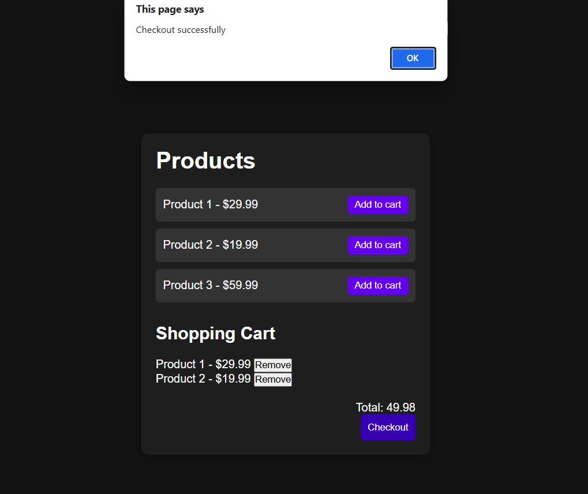

# 🛒 Simple E-Commerce Web App

A lightweight, beginner-friendly **E-Commerce application** built using **HTML**, **CSS**, and **JavaScript**, with **LocalStorage** used to persist cart items. This project allows users to browse products, add them to a cart, and simulate a checkout experience – all without a backend.

## 🚀 Features

- 🧾 Display list of products with name and price  
- 🛒 Add products to cart  
- 🔁 Remove products from cart  
- 💾 Cart data stored in **LocalStorage**  
- 💰 Dynamic total price calculation  
- ✅ Checkout button to clear cart  
- 🎨 Simple and responsive layout (mobile-friendly)

---

## 📂 Project Structure

```plaintext
ecommerce-app/
├── index.html
├── style.css
├── script.js
├── screenshot.png
└── README.md
```

---

## 🧠 Tech Stack

- **HTML** – Structure of the website  
- **CSS** – Styling and layout  
- **JavaScript** – Logic and DOM manipulation  
- **LocalStorage** – For saving cart data on browser

---

## 📦 How to Use

1. Clone the repository:

   ```bash
   git clone https://github.com/anuj-singal/ecommerce-app.git
   cd ecommerce-app
   ```

2. Open `index.html` in your browser (no server needed):

   ```bash
   open index.html
   # OR
   start index.html
   ```

3. Browse products, add to cart, and checkout!

---

## 🔐 LocalStorage Behavior

- The cart is automatically saved in the browser’s **LocalStorage**
- Closing or refreshing the page will retain the cart items
- Clicking **Checkout** will clear the cart from LocalStorage

---

## 📸 Screenshot

<p align="center">
  
</p>

---

## 👤 Author

### Anuj Singal

[](https://github.com/anuj-singal)

---

## 📄 License

This project is licensed under the **MIT License**.  
Feel free to use and modify it for your own projects.

---

## 🌟 Show Your Support

If you liked this project:

- ⭐ Star the repo  
- 🔁 Share it with your friends  
- 🛠️ Improve it and create a PR  


